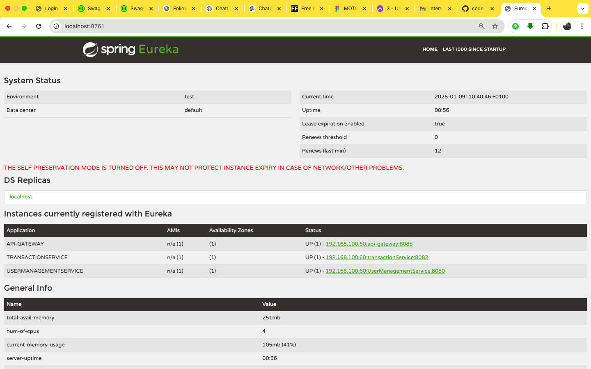

<!-- TABLE OF CONTENTS -->
<details>
  <summary>Table of Contents</summary>
  <ol>
    <li>
      <a href="#about-the-project">About The Project</a>
    <li>
      <a href="#about-the-project">Built With</a>
    <li>
      <a href="#about-the-project">Getting Started</a>
    <li>
      <a href="#about-the-project">Features/Usage</a>
    <li>
      <a href="#about-the-project">Sample Test</a>
    <li>
      <a href="#about-the-project">Sample Data Persisting DB</a>
    <li>
      <a href="#about-the-project">Contact</a>
  </ol>
</details>

<!-- ABOUT THE PROJECT -->
## About The Project



[![SIMPLE BANK OPERATION USING SPRINGBOOT MICROSERVICE][SWAGGER-ENDPOINT-VIEW]](endpoint_swagger.png)

# BankWith3Line Microservices Architecture

The **BankWith3Line** project implements a modern **microservices architecture** to provide scalable and efficient banking solutions. It offers functionalities for user management, account services, transaction processing, and secure API access through a gateway. Service discovery and communication are seamlessly enabled using Eureka Server and OpenFeign.

---

## Services Overview

### 1. **User Management Service**
- **Port**: `8080`
- Handles customer registration, authentication, and user profile management.
- Provides user-related information to other services.

### 2. **Account Service**
- **Port**: `8081`
- Manages customer accounts, including account creation and updates.
- Creates new current accounts and handles initial credit transactions.

### 3. **Transaction Service**
- **Port**: `8082`
- Handles all account transactions, including credits and debits.
- Maintains a transaction ledger for each account.

### 4. **API Gateway (apigw)**
- **Port**: `8765`
- Serves as the centralized entry point for client requests.
- Routes requests to the appropriate microservices securely and efficiently.

### 5. **Discovery Server (myserver)**
- **Port**: `8761`
- Acts as the Eureka service registry for dynamic service discovery.
- Enables load balancing and fault tolerance.

---

## Built With

- **Java 17**
- **Spring Boot**
- **Spring Cloud Gateway**
- **Spring Data JPA**
- **Spring Security**
- **OpenFeign**
- **Spring Cloud Netflix Eureka**
- **H2 Database (In-Memory)**
- **Lombok**
- **Docker**
- **Maven**
- **Swagger**

---

## System Architecture

The **BankWith3Line** system employs a microservices architecture, where each service is specialized for a specific domain. These services communicate through REST APIs, with service discovery facilitated by Eureka Server. OpenFeign simplifies inter-service communication.

### Ports and Service Mapping
| Service                | Port |
|------------------------|------|
| User Management Service | 8080 |
| Account Service         | 8081 |
| Transaction Service     | 8082 |
| API Gateway             | 8085 |
| Eureka Discovery Server | 8761 |


---

## Getting Started

Follow the steps below to set up and run the system locally.

### Prerequisites

- **Java 17**
- **Maven**
- **Docker** (optional for containerized deployment)
- **H2 Database**

### Installation

1. Clone the repository:
   ```bash
   git clone https://github.com/your-repository/bankwith3line.git
   cd bankwith3line
### Step 2: Build the Project

1. Navigate to the root directory of the cloned repository:
   ```bash
   cd bankwith3line

### Step 3: Build all services using Maven:
 ```bash
     mvn clean install


Contact
Sunday Peter

LinkedIn: linkedin.com/in/sundaypeter1
Email: sundaypetersp12@gmail.com
WhatsApp: +234 8186707807
Phone: +234 8169036052